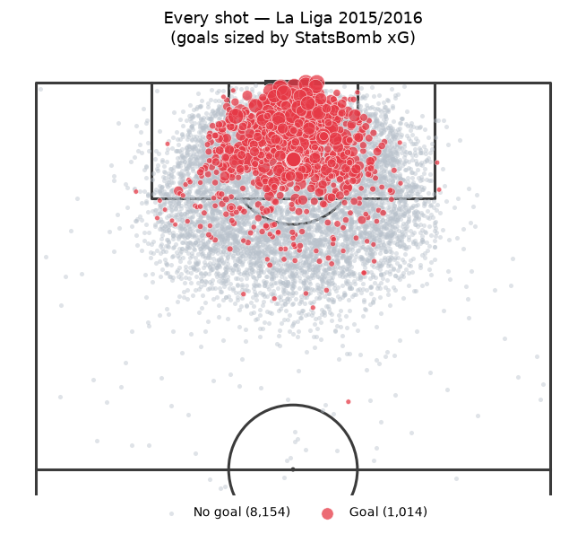
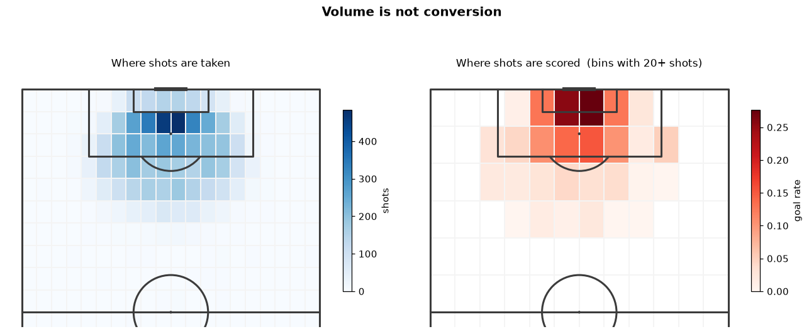
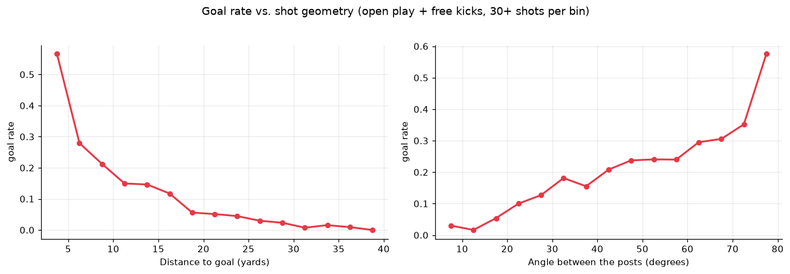
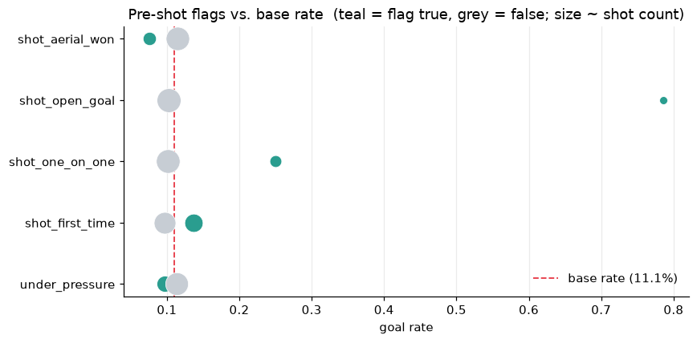
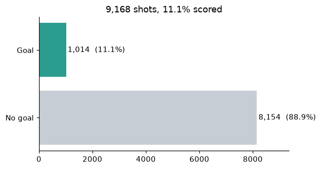
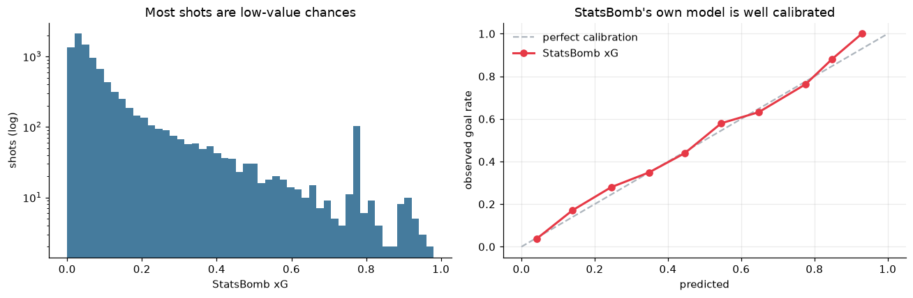

# Expected Goals (xG) & Match Outcome Prediction

A two-stage machine learning system for football analytics, built end-to-end on **real** event data:

1. **Expected Goals (xG)** — score the quality of individual shots, using both a gradient-boosted baseline and a PyTorch sequence model that reads the buildup play preceding each shot.
2. **Match outcome prediction** — aggregate shot- and team-level performance to predict win / draw / loss.

No synthetic data. Every number traces back to StatsBomb's publicly released event data.

## Status

Work in progress, built in stages:

- [x] **0. Project scaffolding & environment**
- [x] **1. Data ingestion & EDA** — [`notebooks/01_data_survey.ipynb`](notebooks/01_data_survey.ipynb)
- [ ] **2. Feature engineering** — shot-level, sequence-level, and match-level features
- [ ] **3. Baseline xG model** — LightGBM + calibration + SHAP
- [ ] **4. PyTorch sequence xG model** — attention over pre-shot events, compared to the baseline
- [ ] **5. Match outcome model** — aggregate to match level, benchmark vs. bookmaker odds
- [ ] **6. Write-up & demo** — portfolio write-up; optional FastAPI endpoint

## The data

**StatsBomb Open Data — La Liga 2015/16**, the complete season.

| | |
| --- | --- |
| Competition | La Liga (`competition_id=11`), 2015/16 season (`season_id=27`) |
| Matches | 380 — the full season, all 20 teams |
| Window | 2015-08-21 → 2016-05-15 |
| Events | 1,295,354 |
| Shots | 9,168, of which **1,014 are goals (11.1%)** |
| Freeze frames | Every player's position at the moment of the shot, on **99.1%** of shots |

Each event carries a timestamped type (pass, carry, pressure, shot…), a pitch location on a
normalised 120×80 grid, and type-specific detail. Shots additionally carry a **freeze frame** — a
positional snapshot of every player in view when the ball was struck. That field is what makes
"defenders in the shot cone" and true goalkeeper positioning computable rather than aspirational,
and it's the main reason this dataset is worth the trouble.



Goals collapse into the six-yard box and the penalty spot while misses spray across the whole final
third. That concentration *is* the signal an xG model exists to capture.

The full survey is [`notebooks/01_data_survey.ipynb`](notebooks/01_data_survey.ipynb). What follows
is what it concluded.

### Why this season

The free tier is uneven, and the wrong choice bakes in bias that no amount of modelling undoes.
Most La Liga seasons in the release are *Barcelona-only* — every match features one club, because
the data was published to showcase Messi's career. An xG model trained on that learns one team's
shot profile and calls it football.

The decisive column is the last one: the share of matches the single most-covered team appears in.
**~10% is a balanced league; 100% is a single-team highlight reel.**

| Competition-season | Matches | Teams | Most covered team | Their share |
| --- | ---: | ---: | --- | ---: |
| **La Liga 2015/16** ← | **380** | **20** | Málaga | **10%** |
| Premier League 2015/16 | 380 | 20 | Chelsea | 10% |
| World Cup 2022 | 64 | 32 | Argentina | 11% |
| Euro 2024 | 51 | 24 | Spain | 14% |
| La Liga 2020/21 | 35 | 19 | Barcelona | 100% |
| Bundesliga 2023/24 | 34 | 18 | Bayer Leverkusen | 100% |
| Ligue 1 2022/23 | 32 | 20 | Paris Saint-Germain | 100% |

La Liga 2015/16 is one of the few complete league seasons in the free tier: 380 matches, no team in
more than 10% of them. The tournaments are balanced too, but small — 64 and 51 matches against 380.
The single-team releases sit at the bottom at 100%, and they are the trap this table exists to
avoid.

### Does the data hold up?

Real data has real defects, and the ones here are better known now than discovered at training
time. `src/football_xg/validate.py` states what should be true of the ingested tables and reports
where it isn't — 10 checks, none failing:

```text
[WARN] missing:   81 shots (0.88%) have no freeze frame; defensive features cannot be computed
[NOTE] locations: 11 shots (0.12%) from the defensive half
[OK  ] leakage:   no post-shot fields in the shots table
[OK  ] scores:    all 1043 goals in 380 matches reconcile with shots + 29 own goals, exactly
[OK  ] team_ids:  every shot's team plays in its own fixture
...
```

The **score reconciliation** is the strongest check available: it ties our derived tables back to
the recorded scoreline, a field nothing in the pipeline touches. Shot-goals alone don't reconcile,
because an own goal is its own event type rather than a shot. Adding own goals closes the gap to
*exactly zero* across all 380 matches — good evidence that no shots are being lost or
double-counted.

The two non-clean findings are both real properties of the data rather than bugs. **81 shots lack a
freeze frame**, so the defensive features need a defined fallback rather than a silent NaN. **11
shots come from the defensive half** — long-range efforts; a cluster of them would have meant the
attacking-direction normalisation was broken, and 0.12% means it isn't.

### What the survey found

**Volume is not conversion — the premise of the whole project.**



Volume peaks around the penalty spot (the modal open-play shot comes from 10–12 yards) and trails
off gradually past 30. Conversion peaks in a far tighter region inside the six-yard box and has
already collapsed by the time you reach that volume peak. The two maps disagreeing is exactly why
xG exists: **shot count is a bad proxy for chance quality.** A team taking 20 speculative efforts
from the D has not outplayed a team that took 4 from six yards — but a raw shot count says it did.

**Location dominates, and non-linearly.**



Neither feature exists in the data — both are derived from the shot's coordinates and the goal
geometry in `config`. Conversion falls off a cliff over the first ~12 yards then flattens into a
long tail, and climbs steeply once the angle opens past ~30°. Both relationships are strong,
monotonic and distinctly non-linear, which is a direct argument for trees over plain logistic
regression as the baseline.

**Pre-shot flags, and one confounder worth keeping.**



`shot_open_goal` and `shot_one_on_one` move conversion enormously, as they should — both describe a
keeper who isn't in the way, and both are legitimately known at the moment of contact. `under_pressure`
is the interesting one: it barely moves the base rate, but that's *confounded*, because pressure
correlates with being close to goal, which raises conversion. A model with both features can separate
what a crosstab cannot, so it stays.

**Two traps that a less careful pass would have encoded.**

`play_pattern="Other"` converts at **67%** against an 11% base rate. That's an artefact, not a
discovery — **97 of those 109 shots are penalties**. Excluding penalties collapses the category to
12 shots, too sparse to encode; one-hot encoding it unexamined would have produced a near-empty
column carrying a wildly misleading prior. Underneath the artefact there's genuine signal: counters
convert at **18.2%**, while corners and throw-ins *under*perform at **8.9%** despite corners'
reputation as set-piece gold.

**Penalties are degenerate.** All 97 come from the same spot with no defenders and convert at 71.1%
— distance, angle and pressure are all constant, so there is no geometry to learn. Including them
would create a cluster the model memorises, inflating the headline metric while teaching it nothing
about open play. They're excluded from the xG model (standard practice) but flagged rather than
dropped at ingestion, so the match-outcome model can still count them: a penalty is still a goal on
the scoreboard.

## Setup

Requires Python 3.12.

**macOS only** — LightGBM's wheel links against OpenMP, which macOS does not ship. Install it first, or `import lightgbm` fails with `Library not loaded: @rpath/libomp.dylib`:

```bash
brew install libomp
```

Then create the environment:

```bash
python3.12 -m venv .venv
.venv/bin/pip install -r requirements.txt
.venv/bin/pip install -e .
```

To reproduce the exact versions this project was developed against, use the lock file
instead of `requirements.txt`:

```bash
.venv/bin/pip install -r requirements.lock.txt
```

Register the environment as a Jupyter kernel so the notebooks use it:

```bash
.venv/bin/python -m ipykernel install --user \
  --name football-xg --display-name "Python (football-xg)"
```

Verify the install:

```bash
.venv/bin/pytest
```

## Project layout

| Path | Contents |
| --- | --- |
| `src/football_xg/config.py` | Paths, pitch geometry, competition scope — everything else imports from here |
| `src/football_xg/data.py` | StatsBomb ingestion, on-disk cache, shots table |
| `src/football_xg/validate.py` | Data quality checks, including the leakage guard |
| `notebooks/` | Exploratory analysis only — findings get promoted into `src/` |
| `data/raw/` | Cached StatsBomb JSON (git-ignored, reproducible) |
| `data/processed/` | Derived parquet tables (git-ignored, reproducible) |
| `models/` | Trained model artifacts (git-ignored) |
| `reports/figures/` | Generated plots (git-ignored) |
| `tests/` | Test suite |

Data and artifacts are deliberately kept out of git — everything under `data/` and
`models/` can be regenerated from the pipeline in `src/`.

## Methodology notes

Two concerns drive most of the design decisions in this repo:

- **Leakage.** Shot outcome must be predicted using only information available *before* the ball is struck. Post-shot fields — where the ball ended up, whether it was deflected, whether it was saved — are dropped at ingestion rather than filtered at training time, so no feature can reach them by accident. They're enumerated in `data.POST_SHOT_FIELDS` and a test asserts none survive. Splits are time-respecting: train on earlier matches, test on later ones, never a random shuffle.
- **Class imbalance.** 11.1% of shots are goals, so accuracy is meaningless — predicting "no goal" every time scores 88.9%. Models are judged on log loss, Brier score, and calibration curves. An xG model is only useful if its probabilities are honest.



Roughly one shot in nine is a goal. What an xG model is actually *for* is producing honest
probabilities: when it says 0.3, roughly 30% of those shots should go in. That is what log loss,
Brier score and calibration curves measure, and accuracy cannot.

### The benchmark

Two reference points bracket the problem, both measured in the survey notebook:

| | Log loss | Brier |
| --- | --- | --- |
| Predicting the base rate (the floor) | 0.3478 | 0.0984 |
| StatsBomb's own xG (the bar) | 0.2593 | 0.0751 |



StatsBomb ship their xG on every shot. It is **not** a feature — training on it would just teach our
model to imitate theirs. It's well calibrated on this season (right) and its season total lands
within 3.4% of actual goals scored, so it's a serious benchmark rather than a strawman. Most shots
are low-value chances (left, log scale) — the spike at ~0.78 is the penalties, all carrying near
enough the same xG, which is the degeneracy that gets them excluded made visible.

**Base rate is the floor, StatsBomb is the bar.**

## Data & attribution

Data provided by **StatsBomb** via their [Open Data](https://github.com/statsbomb/open-data) release, used here under their terms for research and analysis.

## License

Code in this repository is available for review as a portfolio piece. StatsBomb data is subject to the [StatsBomb Open Data terms](https://github.com/statsbomb/open-data/blob/master/LICENSE.pdf).
